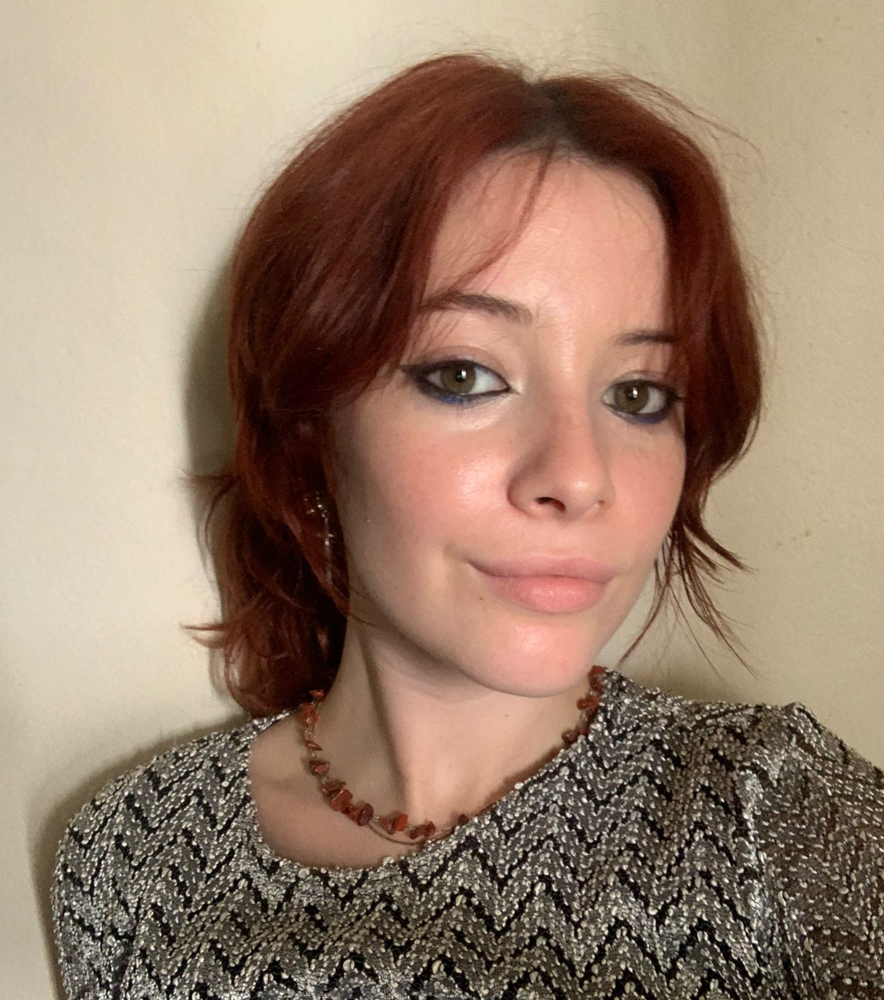

---
title: "Ruby's resume"
author: Ruby Mccrae
date: "`r Sys.Date()`"
output:
  pagedown::html_resume:
    # set it to true for a self-contained HTML page but it'll take longer to render
    self_contained: true
# uncomment this line to produce HTML and PDF in RStudio:
#knit: pagedown::chrome_print
---

Aside
================================================================================
{width=80%}

Contact Info {#contact}
--------------------------------------------------------------------------------
- <i class="fa fa-envelope"></i> ruby.mccrae215@gmail.com
- <i class="fa fa-envelope"></i> info@rubymccrae.art
- <i class="fa fa-phone"></i> +27 0832156597
- For more information, please contact me via email

Skills {#skills}
--------------------------------------------------------------------------------
- Customer Relations
- Graphic design (on Canva) 
- WordPress website management
- Content creation:
  - Written content
  - Social media content
  - Web graphic creation 
- Social analytics and reporting 
- Social Media strategy development
- Shipping and receiving 
- Stock management
- Ability to effectively plan 
- Originality
- Teamwork Skills
- Influencer outreach management

Main
================================================================================

Ruby McCrae {#title}
--------------------------------------------------------------------------------

### Currently a student at the Michaelis School of Fine Art in CapeTown

I am a Sales Assistant with one year of experience working amongst the
elite, making successful sales of several highly sought after artworks and
Books. I am warm and calculated in my approach to assisting clients,
always ensuring a positive informing experience.
Over the course of my working year my employer received multiple
compliments about my service from clients in which I had helped.
Social Media Manager with one year of content development experience
for several different accounts on varied platforms. I Adapt
communications strategy based on data and market trends and build
company reputation through dynamic campaign management. I am
skilled in writing and video editing.
I am a highly ambitious student with background in sales, marketing,
advertising and raising brand awareness and reputation through expert
marketing strategy. I thrive in maintaining productive professional media
relations for optimal brand exposure for increased company success

Education {data-icon=graduation-cap}
--------------------------------------------------------------------------------

### Michaelis School of Fine Art

At the University of CapeTown

CapeTown, Western Cape

2022

First year

### St Annes Diocesan College

Art, Geography, Biology

Hilton, KwaZulu-Natal

2020

IEB/NSC Matric certificate: 5 A's

Work Experience {data-icon=graduation-cap}
--------------------------------------------------------------------------------

### Sales Assistant

Gallery art sales

David Krut Projects, Johannesburg

02/2021 - 12/2021

- Greeted customers and offered assistance with selecting merchandise, finding accessories, and completing purchases.
- Organised marketing plans and programmes to best support business growth and development.
- Wrote engaging, entertaining, and informative media scripts for different uses.
- Conducted market research to assess potential demand and determine optimal characteristics for the Bookstore.
- Warmly greeted customers with positive telephone etiquette, asking well-rounded questions to identify issues.
- Managed multiple customers at a time, making sure to tend carefully to each individuals needs.
- Created a strong clientele by forming trusting bonds with clients.

### Social Media Manager

N/A 

David Krut Projects, Johannesburg

02/2021 - 12/2021

- Executed successful, innovative social media marketing campaigns with clear call-to-action.
- Employed social media expertise to manage curation of relevant, engaging content for varied platforms, including Tik Tok, Facebook and Instagram.
- Gathered data on engagement rate, reach, and impressions to enhance online campaigns.
- Forged working relationships with Instagram influencers to promote brand awareness through sponsored content.
- Performed regular research to stay abreast of emerging social trends, retaining position as industry leaders.

### Gallery Assistant

N/A

David Krut Projects, Johannesburg

02/2021 - 12/2021

- Led tours around the gallery and facilitated large visitor groups. Designed labels for several art pieces with specific information and layout.
- Dealt with incoming and outgoing works of art to ensure safety, correctness and punctuality of shipments.
- Led gallery tours and taught courses to educate general public on topics related to gallery exhibitions.
- Identified repair needs and executed optimal strategies to avoid damaging financially and culturally valuable pieces.
- Informed visitors of exhibit features and highlights to promote enriching gallery experiences.
- Conducted thorough venue inspections to accurately identify cleaning needs and determine appropriate cleaning techniques.
 
### Event Co-ordinator

Golf course Event Co-ordintation

DuckHook Golf Course, Johannesburg

12/2020 - 02/2021

- Managed onsite facilities team comprised of catering services and audio-visual services.
- Coordinated Golf days, dealing with vendors, participants and sponsors.

